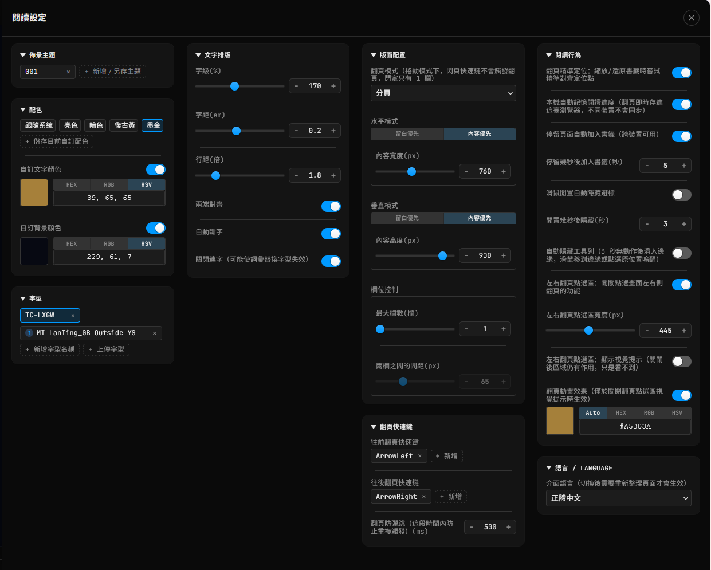

# calibre-web-foliate-docker

[English](README.md) | **繁體中文**

把 [Calibre-Web](https://github.com/janeczku/calibre-web) 內建的 epub.js 閱讀器換成 [foliate-js](https://github.com/johnfactotum/foliate-js) 閱讀器的 Docker image。它是 Tampermonkey 腳本 [calibre-web-foliate-mod](https://github.com/bgtsai/calibre-web-foliate-mod) 的伺服器端版本：同一個閱讀器，直接內建在 Calibre-Web 裡，**不需要在瀏覽器安裝任何外掛**——凡是連到這台 Calibre-Web 的裝置（電腦、手機、平板，包含 iPhone、iPad）打開 EPUB，都會直接使用新的閱讀器。介面支援繁體中文／英文。



## 這是為了什麼寫的

Calibre-Web 內建的 epub.js 閱讀器，排版控制項有限（字級、字距、行距、留白這些細部排版選項都沒有或不夠精準），介面樣式也沒辦法自訂；foliate-js 的排版控制更細緻，可以深度自訂外觀。Tampermonkey 腳本版是在瀏覽器端換掉閱讀器，但必須安裝 Tampermonkey，iOS 上沒辦法用。這個 image 改在伺服器端替換，同時保留 Calibre-Web 原本的書籤同步、閱讀進度這些既有機制，原本習慣的操作方式維持不變，只是排版引擎跟介面換了。

## 功能說明

### 文字排版

- **字級**：可調整範圍 70%～300%。
- **字距**：可調整範圍 −0.05em～0.5em。
- **行距**：可調整範圍 1 倍～5 倍。
- **兩端對齊**：開關切換。
- **自動斷字**：開關切換。
- **關閉連字**：停用字型的 OpenType 連字替換功能。適用於以連字機制實現進階功能的字型，例如在字型層級做文字轉換（常見於具備顯示層簡繁轉換功能的字型）。這類字型在搭配自訂字距使用時，可能出現特定詞彙的字距明顯比周圍文字窄的問題；開啟此選項可讓字距套用均勻，代價是字型的替換功能（如詞彙級的簡繁轉換）會一併停用。

> [!NOTE]
> 如果你在設定字距後，發現某些詞彙或字元組合的間距明顯比周圍文字緊，請試著開啟**關閉連字**。這個問題最常見於使用了字圖替換來實現文字轉換的字型。

> [!TIP]
> 所有數值欄位都可以直接輸入，也可以用兩側的 **−／＋** 按鈕增減（按住可連續增減）。點一下滑桿或數值框讓它取得焦點後，也能用方向鍵或滑鼠滾輪微調：滑桿用 ↑→／↓←，數值框用 ↑／↓。增減的單位跟著目前數值的小數位數走（例如行距 1.25 會以 0.01 增減），但不會比該欄位的最小調整單位更粗。

### 版面配置

- **翻頁模式**：分頁或捲動模式切換。
- **水平模式**：留白優先（固定留白值）或內容優先（固定內容寬度）。內容優先模式下可設定目標內容寬度（像素），留白自動吸收剩餘空間，切換全螢幕時內容寬度維持一致。
- **垂直模式**：同水平模式邏輯，適用於上下方向的留白與內容高度。
- **欄位控制**：分頁模式下可設定最大欄數及兩欄之間的間距。捲動模式下強制鎖定為 1 欄，此兩項設定自動停用。

### 佈景主題與配色

- **佈景主題**：把目前的文字排版、版面配置與顏色設定另存成具名主題，一鍵切換。多組主題支援拖曳排序，也可以用目前設定覆蓋更新既有主題。
- **套用顏色**：內建跟隨系統、亮色、暗色、復古黃、墨金五組配色，加上自己另存的配色。點一下配色，就會把它的文字顏色與背景顏色填進下方兩個自訂欄位、並打開兩個開關；之後只要手動改了顏色或切了開關，標示就會取消。標示在**跟隨系統**時，系統切換深色／淺色模式會自動重新填入對應的顏色。
- **自訂顏色**：文字顏色與背景顏色各有一個開關——開啟就套用欄位裡的顏色，關閉就使用書本自己的顏色。可用 HEX / RGB / HSV 格式輸入，也提供內建取色器。**＋ 儲存目前自訂配色**會把目前這組顏色存起來，存好的配色可改名、拖曳排序。
- **工具列與面板跟著頁面變色**：工具列、設定面板、目錄會依照目前書頁實際的背景顏色，自動切換深色或淺色。

### 字型

- 可手動輸入系統已安裝的字型名稱，也可以直接上傳字型檔案（.ttf / .otf / .woff）嵌入使用。上傳的字型檔案存放於瀏覽器的 IndexedDB，重新整理頁面後仍然有效。字型清單支援拖曳排序。

### 翻頁快速鍵

- 往前／往後翻頁的鍵盤快速鍵可自訂，每個方向可錄製多組按鍵組合。
- **翻頁防彈跳**：設定同一快速鍵連續觸發的最短間隔時間（毫秒），避免意外重複翻頁。
- 也可以用**滑鼠滾輪**翻頁（在書頁上或下方的進度條上滾動）。
- 設定面板開啟時，翻頁快速鍵與滾輪翻頁都會暫停，方向鍵與滾輪改用來調整設定數值；目錄面板開啟時快速鍵仍可翻頁。

### 閱讀行為

- **翻頁精準定位**（實驗性功能，預設關閉）：切換全螢幕、縮放視窗或調整排版設定後，讓原本頁面的**第一個字**精確維持在新版面的頁首，之後往前往後翻頁都接續這個位置；從目錄、連結或進度條跳轉時則恢復章節原本的分頁。捲動模式下自動停用。
- **本機自動記憶進度**：每次翻頁即時記住閱讀位置，重新開啟書籍時自動還原。
- **自動同步至伺服器**：可選擇在閒置一段設定時間後，自動把本機進度同步回 Calibre-Web 的伺服器書籤，也可手動觸發。
- **滑鼠閒置自動隱藏游標**：滑鼠靜止超過設定秒數後自動隱藏游標，移動時重新出現。
- **自動隱藏工具列**：閒置幾秒後工具列與進度條自動滑出畫面，滑鼠移到邊緣或點擊即可喚醒。
- **左右翻頁點擊區**：畫面左右兩側的可點擊感應區，點擊觸發翻頁。感應區的啟用（是否可點擊）與視覺提示（邊界是否可見）是分開的兩個開關，感應區寬度可自訂像素值。捲動模式下自動停用。
- **翻頁動畫效果**：每次翻頁時，在點擊區位置播放一個方向性箭頭動畫，確認翻頁方向。顏色可自訂或自動跟隨目前主題。啟用翻頁點擊區視覺提示時自動停用。

### 語言

- 預設依瀏覽器的網頁內容偏好語言自動判斷顯示繁體中文或英文，可在設定裡手動指定，切換後需重新整理頁面才會生效。

## 快速開始

**鏡像**：`ghcr.io/bgtsai/calibre-web-foliate-docker:latest`——[映像檔倉庫頁面（版本、拉取指令）](https://github.com/bgtsai/calibre-web-foliate-docker/pkgs/container/calibre-web-foliate-docker)

```yaml
services:
  calibre-web-foliate:
    image: ghcr.io/bgtsai/calibre-web-foliate-docker:latest
    container_name: calibre-web-foliate
    environment:
      - PUID=1000
      - PGID=1000
      - TZ=Asia/Taipei
    volumes:
      - /path/to/config:/config
      - /path/to/books:/books
    ports:
      - 8083:8083
    restart: unless-stopped
```

以 [linuxserver/docker-calibre-web](https://github.com/linuxserver/docker-calibre-web) 為基礎，用法相同：如果你原本就在用那個 image，只要把 `image:` 這一行換掉即可，設定檔、書庫路徑都不用改。之後在 Calibre-Web 開啟任一本 EPUB，右上角齒輪圖示可以開啟設定面板。

## 與 Tampermonkey 腳本版的差異

閱讀器程式取自腳本版指定版本的原始碼，功能相同。差別在於：

- **設定依瀏覽器、依網址分開存放。** 設定存在瀏覽器的 `localStorage`（上傳的字型存在 IndexedDB），不是 Tampermonkey 的儲存空間。瀏覽器會依網址分開保存，所以用兩個不同網址開同一台 Calibre-Web（例如區網 IP 與網域名稱），會是兩份各自獨立的設定；清除瀏覽器的網站資料時，設定也會一併清除。
- **舊版 iPhone／iPad 也能用。** 建置時會把閱讀器轉成 iOS 15 的 Safari 也能執行的版本，並補上缺少的內建函式。部分只有 PDF 才會用到的新函式沒有補，舊版 iOS 開 PDF 可能出錯。
- **錯誤面板。** 閱讀頁發生錯誤時，左下角會出現紅色「⚠ 數量」按鈕，點開可看到錯誤清單並一鍵複製，方便在沒有開發者工具的裝置上回報問題。如果閱讀頁直接當掉，在閱讀頁網址後面加上 `?cwfm=safe`：頁面會跳過載入閱讀器，顯示上一次的錯誤紀錄。

## 介面語言顯示不符預期？

介面預設依瀏覽器回報的「網頁內容偏好語言」自動判斷（開頭是 `zh` 就顯示繁體中文，其他一律顯示英文）。這組設定跟瀏覽器本身的**介面顯示語言**（選單、按鈕這些）是兩個各自獨立、可以不一樣的設定。如果自動判斷的結果不是你要的，可以：

- 到設定面板最下方的「語言 / Language」分組，手動指定要顯示的語言（切換後需要重新整理頁面才會生效）；或
- 調整瀏覽器本身「網頁內容偏好語言」的設定（以 Firefox 為例：設定 → 一般 → 語言 → 選擇偏好語言以顯示網頁，把繁體中文排到清單最上面）。

## 運作方式

閱讀器程式碼不另存副本，建置 image 時直接從 [calibre-web-foliate-mod](https://github.com/bgtsai/calibre-web-foliate-mod) 的指定 commit（`Dockerfile` 的 `CWFM_MOD_REF`）組裝：

| 檔案 | 說明 |
|---|---|
| `cps/static/js/cwfm/cwfm-reader.js` | foliate-js 引擎 + 閱讀器介面，由 `build/make_reader.py` 從 mod 原始碼產生 |
| `cps/templates/read.html` | 由 `build/patch_read_html.py` 就地修改：移除舊 epub.js 閱讀器的腳本與樣式，加入上面這支程式；頁面其餘結構保留 |

只改上表這兩個檔案，Calibre-Web 其餘部分（伺服器端、其他頁面、書庫、書籤、使用者管理）完全不動。修改 `read.html` 之前，會先確認它依賴的每個錨點都剛好出現一次，全部通過才寫入；如果上游改版動到這一頁、對不上了，建置會直接失敗，image 維持上一版，不會產出壞掉的頁面。iOS 15 相容轉換在 `build/legacy/`，錯誤面板在 `build/error_panel.html`。

舊閱讀器的檔案本身仍留在 image 裡（其他頁面可能用到），只是 epub 閱讀頁不再載入。

升級閱讀器：把 `Dockerfile` 的 `CWFM_MOD_REF` 改成 mod 新的 commit SHA 並推送即可。這個值同時當作瀏覽器快取破壞參數，換版後不會讀到舊檔。

## 建置狀態 RSS

每天台灣時間 12:00 檢查上游 `linuxserver/calibre-web`，有新版就自動重新建置。每次執行都會在下面這個 RSS 新增一則：

https://raw.githubusercontent.com/bgtsai/calibre-web-foliate-docker/main/build_status.xml

🟢 上游無更新 · 🔵 已更新建置 · 🔴 失敗（image 維持上一版）。

## 授權

本專案基於 [linuxserver/docker-calibre-web](https://github.com/linuxserver/docker-calibre-web)（GPL v3）與 [janeczku/calibre-web](https://github.com/janeczku/calibre-web)（GPL v3），以 GPL v3 授權釋出。

foliate-js 以 MIT 授權釋出，已包含在本專案中。
